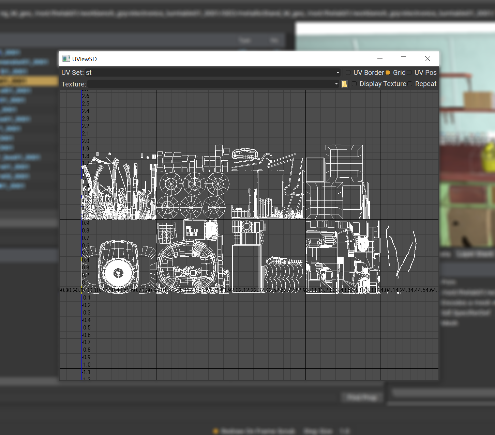
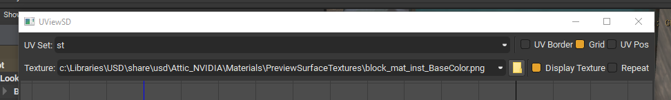
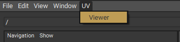

# UViewSD

UViewSD is a python QOpenGLWidget that acts as a uv viewer for USD data. It comes setup as a usdview plugin but can easily be extended to be used inside other DCC applications.
The viewer itself allows a user to view uv's of selected usd mesh prims. The user can toggle the uv set based on what data is available on the prim, and also view any textures used in the material bound to the prim (or manually load their own texture).
Note: UViewSD is NOT an editor, there is no way to edit and save out uv tweaks within the UI.

Example asset `/root/thelab01/workbench_grp/electronics_turntable01_0001` from [USD-ALab](https://animallogic.com/usd-alab/).

## Configuration

Top Row:
- UV Set name.
    - This option box will be made up of the available uv names in the current mesh selection.
        - See [PrimDataExtractor](https://github.com/DanielSpringall/UViewSD/blob/main/uviewsd/core/usdextractor.py) for more information on how these names are discovered on the mesh prim.
    - Changing the active uv set will change it for all selected meshes in the view. So if a mesh doesn't contain the specific uv set selected, nothing will be displayed for that mesh.
- UV Borders.
    - Toggle the thick line on/off for the UV edge borders.
- Grid.
    - Toggle the background grid and numbers on/off.
- UV Position.
    - Toggle the display in the bottom left of the view of the UV value corresponding to the current mouse position in the view.

Bottom Row:
- Texture Path:
    - The current texture path displayed in the view.
        - When expanded, the combo box will display 5 last used textures since the UI has been open.
        - When expanded, the combo box will display textures used in shaders bound to any of the currently selected prims.
- Open:
    - Option to manually load a texture file for viewing.
- Display Texture:
    - A toggle to enable/disable the visibility of the texture in the view.
- Repeat:
    - A toggle to repeat the texture for each UDIM in the views grid.

## View Navigation
- Pan
    - Alt + Middle Mouse Button.
- Zoom
    - Scroll wheel.
    - Alt + Right Mouse Button.
- Focus
    - F.

## Usdview Plugin
Setting up UViewSD for use in usdview is straight forward. Add the `/local/path/to/UViewSD` to your `PYTHONPATH` environment variable. Then add or append `/local/path/to/UViewSD/uviewsd/usdviewplugin` to the `PXR_PLUGINPATH_NAME` environment variable. The next time you launch usdview you will be able to launch the UViewSD window from the menu. UV->Viewer.

When the UI is open, upon selection in usdview, any selected meshes will be added to the UViewSD widget.

## DCC Applications
There is no explicit setup currently for DCC applications, to create one you can use [UViewSDWindow/UViewSDWidget](https://github.com/DanielSpringall/UViewSD/blob/main/uviewsd/widget).
For a minimum setup you will need to work out how to pass the usd stage to the window class, and how to pass the prim paths of the prims in the stage you want to view.
You can look at an example of this in the [USDViewerUVWindow](https://github.com/DanielSpringall/UViewSD/blob/main/uviewsd/usdviewplugin/window.py).

## Dependencies
- [USD](https://github.com/PixarAnimationStudios/USD)
- [PySide2](http://wiki.qt.io/PySide2)
- [PyOpenGL](https://pypi.python.org/pypi/PyOpenGL/)
- [numpy](https://numpy.org/)
- [Pillow](https://github.com/python-pillow/Pillow/)
